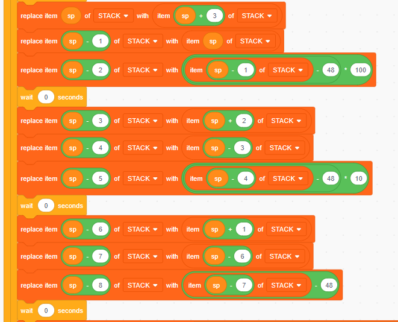

# Nyandesuka??
> Category: Rev
> Difficulty: Hard

This is a Scratch reverse challenge partially generated with [scratch-llvm](https://github.com/alyssarosenzweig/scratch-llvm).

The challenge requires you to input a 12 digit passcode, and when you get it right you will be able to access a [pastebin link](https://pastebin.com/3iE7wPCw) with the flag

Behaviour is quite intuitive so let's just jump straight into reversing.

The sprite in the program prints text when it receives either the `solved` broadcast or the `unsolved` broadcast. We can get the partial pastebin link here (https://pastebin.com/3iE7) from what the player should presume is the win condition. Let us switch over to the "Stage" side of the program.

The first part of the stage is immediately after green flag is clicked. We note the following variables:
- `passcode`, which is the input the user provides
- `winning` some mystery variable for the timebeing
- a list called `STACK` which is populated by `.rodata`, which is empty
- `sp`, some mystery variable set to 1020
- `input_line_cursor`, which is set to zero

There's no behaviour here to really analyse....

Let's look at the other functions that we have

The `@getchar` function actually behaves as you'd expect `getchar` to behave! You can trace the behaviour quite easily:

- increment `input_line_cursor`
- set `return value` = the n-th letter of `passcode` pointed to by `input_line_cursor`
- index_of `return value` in `alphabet` gets you the ASCII code of `return value`, using `j` as a counter
- set `return value` to `j-1` which is the above

So every time `@getchar` is called, we move on to the next character in `passcode`

`@putchar` works as you'd expect too.

- if `param0` is `13` or `10`, print a newline
- else, append the matching character to `TTY`

that's all. Let's move on to `@main`

First part of `@main` is just some init stuff. Since the `STACK` is empty, the last instruction is the only important one, setting `[sp+4]` to 4. I think it should be quite obvious now that `sp` is basically a stack pointer.

We see here 3 `@getchar` calls, and each time the next character read is saved to `[sp+3]`, `[sp+2]` and `[sp+1]`.

Next, we see that there's a giant `if` wrapping most of the logic, which is dependent on the previously set `[sp+4]` being greater than 0. 

Looking at the end of `@main`, we can see that `[sp+4]` gets decremented, and if the if statement fails, it checks whether `winning == 4` and broadcasts `solved` or `unsolved` accordingly. So we know now that inside the main part of the if statement, it will be called 4 times.

So right now, we know that we have `@getchar` called in batches of 3, four times in total, reading 12 characters. Wow!

So we have some shuffling of the values from `@getchar`, and then we see the following:

- `[sp-2] = ([sp-1] - 48) * 100 = ([sp+3] - 48) * 100`. Note that `'0' == 48`, so this essentially gets the digit at the first position and multiplies by 100.
- `[sp-5] = ([sp-4] - 48) * 10 = ([sp+2] - 48) * 10`. Tens digit, and multiplied by 10.
- `[sp-8] = ([sp-7] - 48) = ([sp+1] - 48)`. The last digit.

Then finally, the three values from above are added together and stored in `[sp-10]`. So, we essentially read a 3 digit number, and calculate the 3 digit value from the characters read. So now we know that the program reads our passcode three digits at a time, splitting it up into 4 three digit numbers.

This is the last bit of the challenge!

So the difference between `[sp-10]` and a constant is stored into `[sp-11]`.

The pattern for each if statement is essentially `[sp+4] == value AND [sp-11] == 0` and if it is, it prints the character and then increments `winning`, so what we want is that at each step the value of `[sp-10]` is equal to the constant that the difference is taken from. So our values are `119`, `80`, `67` and `119` (119 is repeated because it's checked for `[sp+4] % 4 == 0` and `[sp+4] == 1`). 

Because we read 3 digits at a time, we now know our passcode is `119080067119`! And after inputting, we can see the corresponding characters to `119`, `80`, `67` and `119` being printed, which gives `wPCw`.

You now go over to https://pastebin.com/3iE7wPCw and you get the flag!

Flag: `blahaj{1ch1_n1_54n_ny4!_4r16470}`